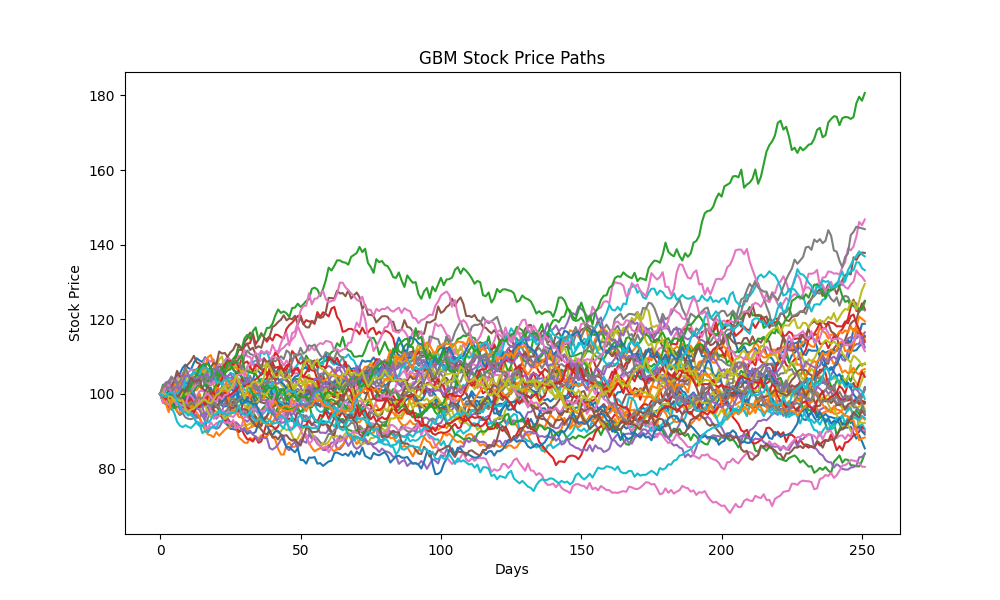
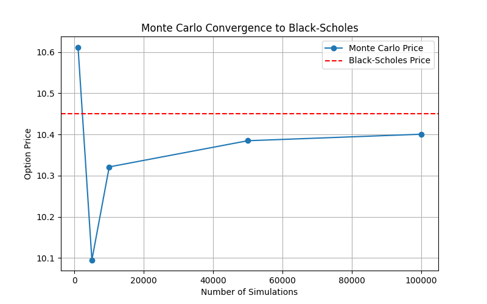
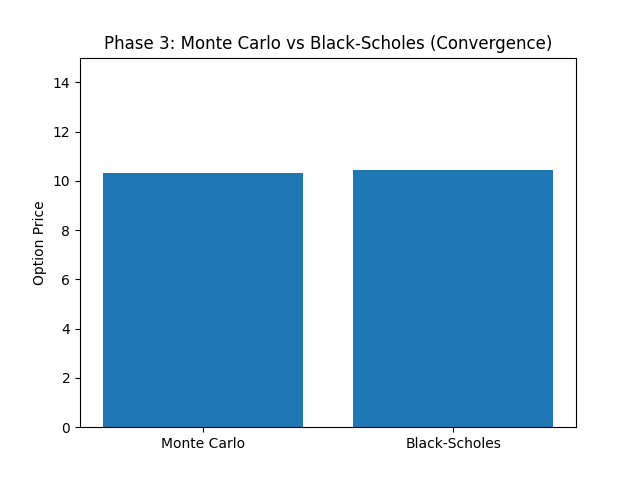
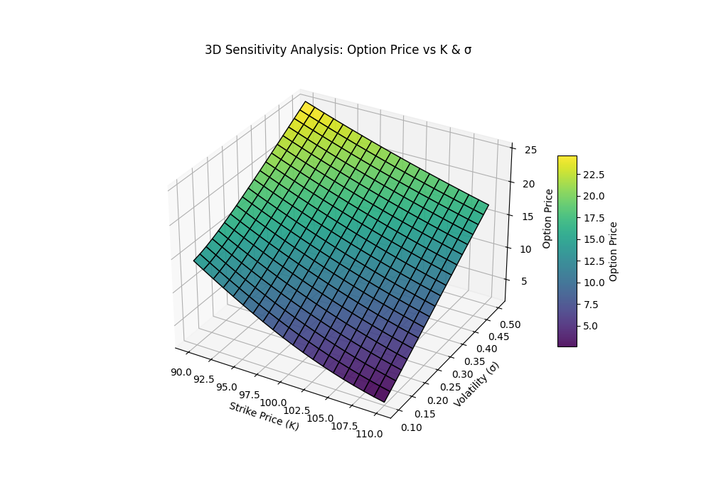
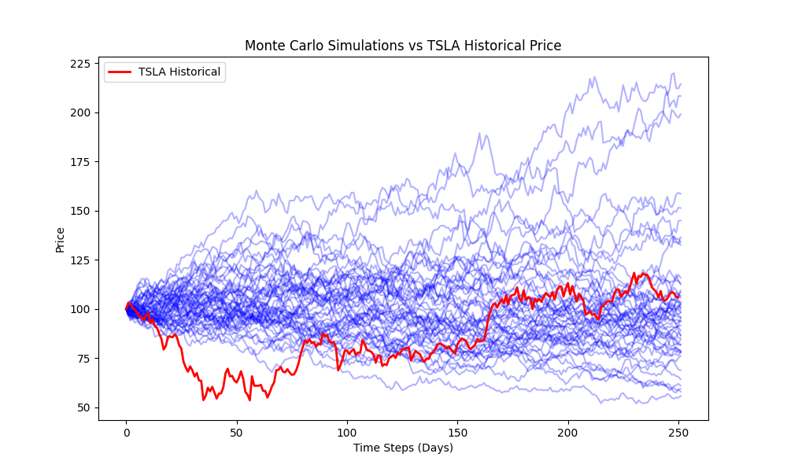

# Monte Carlo Option Pricing – Quantitative Finance Project

Simulates stock price evolution and European option pricing using Monte Carlo simulations, with comparison to Black-Scholes analytical results and validation against historical stock data.

---

## Abstract

This project demonstrates **Monte Carlo simulations for stock price modeling and option pricing**. It progressively explores:

1. Stock price simulation using **Geometric Brownian Motion (GBM)**  
2. Monte Carlo **European call & put option pricing**  
3. Comparison of Monte Carlo prices with **Black-Scholes analytical solution**  
4. **Sensitivity analysis** for volatility, strike price, drift, and maturity  
5. **Real-world validation** with historical stock data (Tesla, Apple, S&P 500)  

Visualizations include **static plots, 3D surfaces, and animated GIFs** for intuitive understanding.

---

## Why This Project

- Provides a **hands-on demonstration** of stochastic modeling in finance.  
- Bridges **theoretical finance** (Black-Scholes formula) with **practical simulation** (Monte Carlo).  
- Visualizes **convergence, error, and sensitivity** of option prices.  
- Applies simulation to **real-world stock data** for validation.  
- Includes **interactive and animated visualizations** for enhanced clarity.

---

## Development Iterations

- **v1.0:** Basic GBM simulation of stock paths  
- **v2.0:** Monte Carlo option pricing with convergence analysis  
- **v3.0:** Analytical comparison with Black-Scholes  
- **v4.0:** 3D sensitivity analysis and parameter study  
- **v5.0:** Real-world validation and animations  

---

## Verification

- Monte Carlo option prices **converge to analytical Black-Scholes values**.  
- Sensitivity analysis confirms expected behaviors for volatility, strike price, drift, and maturity.  
- Historical stock overlays demonstrate **realistic simulation accuracy**.

---

## Requirements

- Python 3.11+  
- NumPy  
- Pandas  
- Matplotlib  
- mpl_toolkits.mplot3d  
- (Optional) Plotly for interactive sliders  

---

## Phase 1: Stock Price Simulation (GBM)

**Scientific Question:**  
“How do stock prices evolve under stochastic motion?”  

**Description:**  
- Simulated multiple stock paths using **Geometric Brownian Motion**.  
- Visualized stochastic trajectories and final price distribution.  

**Static Plot:**  
  

**Key Features:**  
- Multiple stochastic paths  
- Histogram of final stock prices  

**End-state / Outputs:**  
- Code: `phase1_GBM_simulation.py`  
- Plot: `results/GBM_stock_paths.png`  

**What This Demonstrates:**  
- Realistic stochastic stock price behavior.  
- Probabilistic distribution of final prices.

---

## Phase 2: Monte Carlo Option Pricing

**Scientific Question:**  
“How can European options be priced using Monte Carlo simulations?”  

**Description:**  
- Calculated European call & put option prices from simulated stock paths.  
- Studied convergence with increasing number of Monte Carlo paths.  

**Static Plot:**  
  

**Key Features:**  
- Convergence analysis  
- Confidence intervals for pricing accuracy  

**End-state / Outputs:**  
- Code: `phase2_MC_option_pricing.py`  
- Plot: `results/Phase3_MC_Convergence.png`  

**What This Demonstrates:**  
- Monte Carlo accurately estimates option prices.  
- Reliability increases with more simulation paths.

---

## Phase 3: Analytical Comparison (MC vs Black-Scholes)

**Scientific Question:**  
“How accurate are Monte Carlo prices compared to Black-Scholes analytical solution?”  

**Description:**  
- Compared Monte Carlo option prices to Black-Scholes formula.  
- Highlighted absolute error and convergence trends.  

**Static Plot:**  
  

**Key Features:**  
- MC vs analytical comparison  
- Convergence trends  

**End-state / Outputs:**  
- Code: `phase3_MC_vs_BS_comparison.py`  
- Plot: `results/Phase3_MC_vs_BS.png`  

**What This Demonstrates:**  
- Monte Carlo estimates approach Black-Scholes prices with sufficient paths.  
- Confirms method reliability.

---

## Phase 4: Sensitivity Analysis

**Scientific Question:**  
“How do option prices vary with volatility, strike price, drift, and maturity?”  

**Description:**  
- Studied price changes as model parameters vary.  
- Generated **3D surfaces and heatmaps** for visual clarity.  

**Static Plot 3D Surface:**  
  

**Overlay of MC vs Real Data:**  
  

**Key Features:**  
- Heatmaps of price vs volatility and strike price  
- Overlay of simulated vs historical stock paths  

**End-state / Outputs:**  
- Code: `phase4_sensitivity_analysis.py`  
- Plots: `results/Phase4_Sensitivity3D.png`, `results/Phase5_MC_vs_Real.png`  

**What This Demonstrates:**  
- Effect of parameters on option pricing  
- Validation with real historical data  

---

## Phase 5: Real-World Validation & Animations

**Scientific Question:**  
“Do Monte Carlo simulations match historical stock behavior?”  

**Animations:**  
- Normal Animation:  
  
- Enhanced Animation:  
  

**Key Features:**  
- Visual demonstration of stochastic evolution  
- Comparison of Monte Carlo paths with historical stock trends  

**End-state / Outputs:**  
- Code: `phase5_real_world_animation.py`  
- Animations: `results/animations/Phase5_MC_Animation.gif`  

**What This Demonstrates:**  
- Real-time stochastic evolution  
- Alignment with real stock market trends

---

## Conclusion

This project demonstrates **stochastic modeling, Monte Carlo option pricing, sensitivity analysis, and real-world validation**:

- **Phase 1:** GBM paths visualize stochastic stock price evolution.  
- **Phase 2:** Monte Carlo pricing shows convergence and confidence intervals.  
- **Phase 3:** Analytical comparison validates Monte Carlo against Black-Scholes.  
- **Phase 4:** Sensitivity analysis highlights effects of volatility, strike price, drift, and maturity.  
- **Phase 5:** Animations and historical overlay confirm simulation accuracy.  

Overall, the project combines **simulation, visualization, parameter study, and real-world data validation** to provide a comprehensive understanding of **quantitative finance through Monte Carlo methods**.
